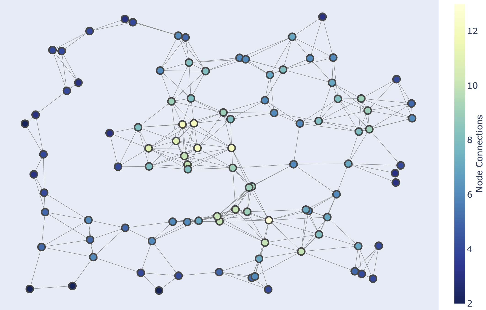

# Meshsim

### What is this project?
MeshSim is a network simulator focused on aiding in the development of routing protocols for Mobile Wireless Ad Hoc Networks (MANETs). Unlike traditional network simulators which follow a discrete-event approach, MeshSim runs the code of simulated node in real-time (as allowed by the underlying OS scheduler). This design choice is motivated by two reasons: to keep a higher-fidelity level of the behaviour of each node in the simulation, and to allow the simulated-node client to be run in a testbed node without modifications.

### Features
* Real-time wireless ad hoc network simulator.
* Allows for the deployment of simulated nodes to testbed nodes without modifications to the code.
* Written in Rust to alleviate memory-management issues, which are common in systems code.
* Utilises a simplified IP model to lower the barrier of entry for developers.
* Packet generator -- 
* Can be easily extended to support more mobility models, workloads, and protocols.

### Use cases
This project is not mean to provide production-ready implementations of any routing protocol, but is meant to serve as a rapid development tool that helps researchers quickly iterate on their designs. Further, its library of protocols can easily be used by researchers to benchmark the performance of their protocols against all the existing ones with ease. MeshSim currently has an implementation of the following protocols:

* [Flooding](https://www.sciencedirect.com/science/article/abs/pii/S0140366400002334) - Naïve flooding of packets through the network, where each node forwards each packet at most once.
* [Gossip flooding](https://ieeexplore.ieee.org/abstract/document/1019424) - An optimisation of the flooding algorithm that reduces the number of packets used while maintaining the  delivery rate.
* [AODV](https://ieeexplore.ieee.org/document/749281) - The Ad hoc On-Demand Distance Vector protocol, as defined in [RFC 3561](https://www.rfc-editor.org/info/rfc3561).
* [RGR]() - The Reactive Gossip Routing protocol. A low-overhead protocol designed for high-mobility scenarios.
* [RGRII]() - An optimisation of RGR that lowers the cost of route discovery by leveraging passively-overheard packets.
* [RGRIII]() - An extension of RGRII that utilises two heterogeneous radios. It improves the accuracy of the RGRII heureistic by leveraging a low-powered beacon that is operated over the secondary radio.

As a PhD student, I found incredibly frustrating that the results and benchmarks of other protocols were of little direct use to me, as you can't extrapolate that data to measure your own work against them. This is because those results were run on different simulators, with unknown configurations and parameters. A goal of this project would be to collect as large a library of protocols as possible so that they can all be evaluated under the same circumstances. This simulator is by no means perfect, nor does it aim to be, but being able to benchmark future work directly against previous protocols under the same constraints would be a huge win for future research in the field.

### Contributing to the project
This project is actively open to receiving PR to improve it. A good way to start contributing to it would be to head into the issues page and pick one them to get started. That being, contributions to this project can be broken down in the following categories:

* **Bug fixes** - Did you find a bug? Please help us fix it! Report it directly into the issues so that we can be aware of it, or better yet, follow that report with a PR that addresses it!
* **Architectural improvements** - This refers to fundeamental improvements that change the way the software is organised and executed, such as [this one](https://github.com/Dash83/mesh_simulator/issues/82). These changes are difficult, and it takes someone that is intimitaly familiar with the code base to do them. However, please feel free to suggest changes of this nature if you have any ideas to improve MeshSim.
* **Content contributions** - These refer to extending the range of protocols supported by the simulator, and the variety of scenarios under which they can be evaluated. They are categorised as:
	* *Protocols* - A new protocol to the MeshSim library.
	* *Mobility model* - The description of a pattern of movement the nodes in the simulation can follow.
	* *Workload* - A specific pattern of packet generation. New patterns are interesting due to varying reasons, such as the effects they induce on the network, because a certain pattern is representative of an application type, or because they stress protocols in a particular way.
* **Documentation** - New wiki pages to ease the use of the tool, as well as new contributions to it.
* **Testing** - The current testing level of the system is lacking. Sufficient tests exist to be run locally, but they are not currently self-contained, making CI fail. Improvements on testing that implement mocking or other techniques are very welcome.

### Examples
MeshSim is composed of two binaries: `master_cli` and `worker_cli`. The execution of a simulation is as simple as calling `master_cli` from a terminal and passing it simulation specification file. These simulation files are TOML-formated documents that describe the general properties of a simulation such as the `duration`, `simulation area`, and `protocol`, but most importantly, they describe the topology of the network.

	

		
		Sample network topology
	

Once a simulation starts, `master_cli` will spawn a process running `worker_cli` per each simulation node described in the specification file. Each one of these nodes will run the configured protocol for the specified duration, and then terminate. The logs of the simulation are placed under the `work_directory` listed in the specification file. These logs act as both traces of what occurred during the simulation, and as data sources. Each log entry is formatted as key-value pair JSON entry, and can be easily parsed to obtain all sorts of metrics from the simulation.

A highly detailed experimental setup that uses MeshSim is available [here](https://github.com/Dash83/PhD_Research). This repository contains the experiments I crafted for my PhD work, as well as the original results.

